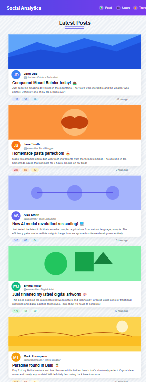

# Social Analytics Dashboard

## Project Overview

Social Analytics is a React-based web application that provides analytics and visualization for social media content. The dashboard allows users to view latest posts, top content creators, and trending topics in an intuitive interface.

## Features

- **Feed View**: Displays latest posts with real-time updates
- **Top Users**: Showcases top content creators ranked by post count
- **Trending Posts**: Highlights posts with the highest engagement
- **Responsive Design**: Optimized for both desktop and mobile devices
- **Real-time Updates**: Polls for new content every 10 seconds

## Technology Stack

- React 18.2.0
- React Router 6.11.2
- Axios for API calls
- Tailwind CSS for styling
- Framer Motion for animations

## Installation and Setup

### Prerequisites
- Node.js (v14 or higher)
- npm

### Installation Steps

1. Clone the repository:
```bash
git clone https://github.com/yourusername/social-analytics.git
cd social-analytics
```

2. Install dependencies:
```bash
npm install
```

3. Start the development server:
```bash
npm start
```

4. Open your browser and navigate to `http://localhost:3000`

## Project Structure

```
social-analytics/
├── public/
│   └── screenshots/
│       ├── dashboard-header.png
│       └── mobile-view.png
├── src/
│   ├── components/
│   │   ├── Feed.js
│   │   ├── TopUsers.js
│   │   └── TrendingPosts.js
│   ├── App.js
│   ├── App.css
│   ├── index.js
│   └── index.css
├── tailwind.config.js
└── package.json
```

## Screenshots

### Dashboard Home


### Mobile Feed View



